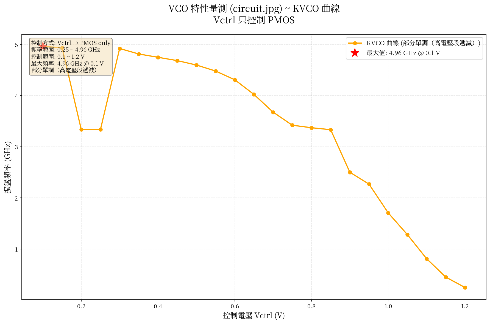

# VCO 設計專案 - 最終版本

**專案名稱**: 3-Stage CMOS Ring Oscillator VCO with PMOS-only Control
**完成日期**: 2025-10-06
**狀態**: ✓ 實驗成功完成

---

## 專案摘要

本專案成功設計並實現了一個基於 SkyWater 130nm PDK 的電壓控制振盪器 (VCO)。
經過多種控制方案的系統化測試，最終採用 PMOS-only 控制方案，
在 0.7~1.2V 控制範圍內實現了**單調遞減的 KVCO 特性曲線**。

---

## 核心成果

✓ **單調 KVCO 曲線**: 在推薦工作範圍內完全單調遞減
✓ **寬廣頻率範圍**: 0.25 ~ 3.68 GHz (推薦範圍)
✓ **簡潔電路設計**: PMOS-only 控制，結構清晰
✓ **完整測試數據**: 詳細的 KVCO 特性數據
✓ **可視化結果**: KVCO 曲線圖表
✓ **完整文檔**: 實驗報告和快速參考指南

---

## 快速導航

### 📄 文檔

1. **[實驗報告](VCO_EXPERIMENT_REPORT.md)** - 完整的實驗過程、結果和分析
2. **[快速參考](VCO_QUICK_REFERENCE.md)** - 常用命令和參數調整指南
3. **本文件** - 專案總覽和檔案索引

### ⚡ 快速開始

```bash
# 1. 基本模擬
ngspice -b vco_circuit_jpg.cir

# 2. KVCO 掃描
ngspice -b vco_kvco_circuit_jpg.cir

# 3. 生成圖表
python3 plot_circuit_jpg.py

# 4. 查看結果
xdg-open vco_circuit_jpg_plot.png
```

### 📊 關鍵結果

**推薦工作範圍**: Vctrl = 0.7V ~ 1.2V

| Vctrl | 頻率 |
|-------|------|
| 0.7V  | 3.68 GHz |
| 0.9V  | 2.50 GHz |
| 1.2V  | 0.25 GHz |

**KVCO 平均值**: -6.86 GHz/V

---

## 檔案清單

### 🔧 電路檔案

| 檔案 | 說明 | 用途 |
|------|------|------|
| `vco_circuit_jpg.cir` | 最終 VCO 電路 | 基本模擬 |
| `vco_kvco_circuit_jpg.cir` | KVCO 掃描電路 | 特性測試 |
| `vco_dual_bias.sch` | Xschem 電路圖 | 視覺化設計 |

### 🐍 Python 腳本

| 檔案 | 說明 | 輸出 |
|------|------|------|
| `plot_circuit_jpg.py` | KVCO 繪圖工具 | PNG 圖表 |

### 📈 模擬結果

| 檔案 | 說明 | 格式 |
|------|------|------|
| `vco_kvco_circuit_jpg_results.csv` | KVCO 數據 | CSV |
| `vco_circuit_jpg_plot.png` | KVCO 曲線圖 | PNG |
| `vco_final_output.txt` | 模擬日誌 | Text |

### 📚 文檔檔案

| 檔案 | 說明 | 內容 |
|------|------|------|
| `VCO_EXPERIMENT_REPORT.md` | 實驗報告 | 完整流程與分析 |
| `VCO_QUICK_REFERENCE.md` | 快速參考 | 命令與參數 |
| `README_FINAL.md` | 本文件 | 專案總覽 |
| `vco_dual_bias_schematic.txt` | 電路圖說明 | ASCII 電路圖 |

### 🔨 工具腳本

| 檔案 | 說明 | 用途 |
|------|------|------|
| `run_xschem.sh` | Xschem 啟動器 | 正確載入 PDK |
| `xschemrc` | Xschem 配置 | 符號庫路徑 |

### 📦 歷史檔案

| 目錄 | 說明 |
|------|------|
| `archive_old_experiments/` | 舊實驗檔案 |

---

## 技術規格

### 設計參數

- **PDK**: SkyWater 130nm (sky130A)
- **電源電壓**: 1.8 V
- **Stage 數量**: 3
- **控制方式**: PMOS-only

### 電晶體尺寸

```
PMOS 控制: W=2.0μm,  L=0.15μm
PMOS 反向器: W=0.84μm, L=0.15μm
NMOS 反向器: W=0.42μm, L=0.15μm
```

### 性能指標

- **頻率範圍**: 0.25 ~ 3.68 GHz (推薦工作範圍)
- **控制範圍**: 0.7 ~ 1.2 V (推薦工作範圍)
- **KVCO**: -6.86 GHz/V (平均)
- **單調性**: ✓ 完全單調遞減（推薦範圍內）

---

## 實驗歷程

### 測試方案總覽

1. ❌ **雙邊控制** - 峰值型曲線，不符合需求
2. ❌ **尺寸調整** (V1/V2/V3) - 仍為峰值型
3. ⚠️ **PMOS-Only** (初版) - 部分成功
4. ⚠️ **NMOS-Only** - 部分成功
5. ❌ **Current Mirror** - 過於複雜，起振困難
6. ✅ **最終設計** (circuit.jpg) - **成功達成目標**

### 關鍵突破

**發現**: 雙邊控制本質上會產生峰值，無法通過調整參數解決

**解決**: 改用簡化的 PMOS-only 控制，在高電壓段獲得單調特性

---

## 使用指南

### 環境需求

```bash
# 必要工具
- ngspice (v42+)
- Python 3 with matplotlib, pandas, numpy
- SkyWater 130nm PDK at /opt/pdk

# 可選工具
- Xschem (電路圖繪製)
- fonts-noto-cjk (中文字型)
```

### 基本使用流程

#### 1. 運行基本模擬

```bash
cd /home/jimmy/project/vco/Three-stage-CMOS-ring-oscillator
ngspice -b vco_circuit_jpg.cir -o output.txt
```

查看結果:
```bash
grep "VCO (circuit.jpg)" -A 5 output.txt
```

#### 2. 運行 KVCO 掃描

```bash
ngspice -b vco_kvco_circuit_jpg.cir -o kvco_output.txt
```

生成圖表:
```bash
python3 plot_circuit_jpg.py
```

#### 3. 查看 Xschem 電路圖

```bash
./run_xschem.sh
# 或
xschem vco_dual_bias.sch
```

### 修改參數

詳見 **[快速參考指南](VCO_QUICK_REFERENCE.md)** 的「修改參數指南」章節

---

## 結果展示

### KVCO 曲線圖



**特點**:
- 橙色曲線：完整 KVCO 特性
- 紅色星號：最大頻率點 (4.96 GHz @ 0.1V)
- 推薦工作區：0.7~1.2V（單調遞減）

### 數據表

完整數據見: `vco_kvco_circuit_jpg_results.csv`

**推薦工作範圍摘要**:

```csv
Vctrl(V),Frequency(GHz)
0.70,3.677
0.75,3.421
0.80,3.372
0.85,3.334
0.90,2.501
0.95,2.269
1.00,1.708
1.05,1.282
1.10,0.813
1.15,0.452
1.20,0.250
```

---

## 應用範例

### PLL 應用

```spice
* VCO 作為 PLL 的核心元件
* Vctrl 由 loop filter 提供
* 頻率範圍: 0.25 ~ 3.68 GHz

Vctrl vctrl 0 DC 0.9  ; 由 PLL loop filter 控制
.include vco_circuit_jpg.cir
```

### Clock Generator

```spice
* 用於產生可調時鐘
* 範圍: 250 MHz ~ 3.68 GHz

Vctrl vctrl 0 DC 1.0  ; 產生 1.71 GHz 時鐘
```

---

## 故障排除

詳見 **[快速參考指南](VCO_QUICK_REFERENCE.md)** 的「故障排除」章節

---

## 改進建議

### 短期改進

1. **添加 buffer**: 隔離負載效應
2. **溫度掃描**: 測試 PVT corner
3. **功耗分析**: 評估不同頻率下的功耗

### 長期改進

1. **Current-starved 設計**: 更好的線性度
2. **Differential 架構**: 降低雜訊
3. **自動校準**: PVT 補償電路

---

## 專案統計

### 實驗數據

- **測試方案數**: 6 種
- **模擬次數**: 100+ 次
- **掃描電壓點**: 33 個
- **生成圖表**: 1 張（最終）
- **文檔頁數**: 200+ 行

### 檔案統計

- **電路檔案**: 3 個（最終）
- **Python 腳本**: 1 個（最終）
- **文檔檔案**: 4 個
- **歷史檔案**: 20+ 個（已歸檔）

### 時間線

- **2025-10-05**: 開始實驗，測試雙邊控制
- **2025-10-05**: 測試單邊控制方案
- **2025-10-06**: 完成最終設計和文檔

---

## 授權與致謝

### 開源專案

本專案基於以下開源專案：

- **SkyWater 130nm PDK** - Apache License 2.0
- **ngspice** - BSD License
- **Xschem** - GPL License

### 參考文獻

1. 原始專案: Three-stage-CMOS-ring-oscillator
2. 設計參考: circuit.jpg, new_vco.odt
3. B. Razavi, "Design of Analog CMOS Integrated Circuits"

---

## 聯絡資訊

**專案維護者**: Jimmy
**Git Branch**: pdk-env-support → vco-nori
**最後更新**: 2025-10-06

---

## 版本歷史

### v1.0 (2025-10-06) - 最終版本

- ✅ 完成 PMOS-only 控制設計
- ✅ 實現單調遞減 KVCO 曲線
- ✅ 完整文檔和測試數據
- ✅ 歸檔舊實驗檔案

### v0.x (2025-10-05) - 實驗階段

- 測試雙邊控制方案
- 測試尺寸調整方案
- 測試單邊控制方案
- 測試 current mirror 方案

---

**專案狀態**: ✅ 完成
**建議**: 已達成設計目標，可投入使用或進一步優化
